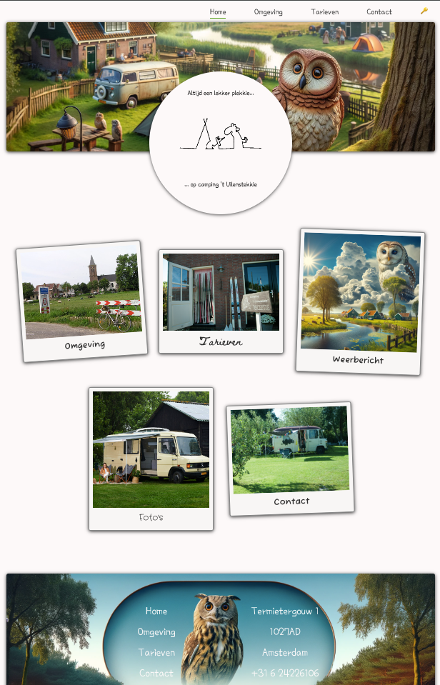

# README - novi_eo_project_t_uilenstekkie

## Inleiding
Welkom bij de installatiehandleiding van de camping-applicatie "'t Uilenstekkie". Deze applicatie biedt bezoekers de mogelijkheid om tarieven van de camping te bekijken, een reservering te maken, het huidige weer en weersvoorspellingen te raadplegen, zien wat er in de omgeving te doen is en meer.

Deze applicatie is gebouwd met React en maakt gebruik van verschillende externe API's om dynamische informatie te verstrekken, zoals weersvoorspellingen en route-informatie. Daarnaast worden gegevens over activiteiten en prijzen in JSON-bestanden beheerd vanwege het ontbreken van een backend. In de onderstaande handleiding wordt uitgelegd hoe je de applicatie lokaal kunt opzetten en uitvoeren.

### Functionaliteiten
- Bekijk campingtarieven en -beschikbaarheid
- Maak een reservering voor de camping
- Bekijk het weerbericht en weersvoorspellingen
- Routeplanning naar de camping en van de camping naar activiteiten in de omgeving
- Zien welke optredens er zijn in Amsterdam
- Admin administratie
- Prijzenbeheer (lokaal opgeslagen)

**Bijzonderheden**: Het ontwerp is bewust eenvoudig gehouden om de uitstraling van een charmante campingwebsite te behouden, zoals gewenst door de eigenaar Dirk. Er is bijvoorbeeld geen optie om gebruikers inloggegevens te onthouden, omdat de frequentie van gebruik laag is en het voor korte administratieve handelingen voldoende is om ad hoc in te loggen.



## Benodigdheden
Om de applicatie te kunnen draaien, heb je het volgende nodig:

1. **Node.js**: versie 16 of hoger. Dit is nodig om JavaScript op je machine te kunnen draaien en om npm (Node Package Manager) te gebruiken.
2. **npm**: Node Package Manager wordt standaard geïnstalleerd met Node.js en is nodig om de benodigde afhankelijkheden te installeren.
3. **API Keys**: Je hebt verschillende API keys nodig om de volledige functionaliteit van de applicatie te kunnen benutten.
   - **OpenWeather API Key**: Voor het ophalen van het weerbericht en weersvoorspellingen.
   - **OpenRouteService API Key**: Voor routeplanning naar de camping.
   - **EmailJS API Key**: Voor het versturen van reserveringsbevestigingen via e-mail.

   Deze API keys moeten worden toegevoegd aan een `.env`-bestand in de root van het project:

   ```env
   VITE_OPENWEATHER_API_KEY=YOUR_OPENWEATHER_API_KEY
   VITE_OPENROUTESERVICE_API_KEY=YOUR_OPENROUTESERVICE_API_KEY
   VITE_EMAILJS_SERVICE_ID=YOUR_EMAILJS_SERVICE_ID
   VITE_EMAILJS_TEMPLATE_ID=YOUR_EMAILJS_TEMPLATE_ID
   VITE_EMAILJS_USER_ID=YOUR_EMAILJS_USER_ID
   VITE_EMAILJS_TEMPLATE_RESERVATION_ID=YOUR_EMAILJS_TEMPLATE_RESERVATION_ID
   ```
   **Het huidige .env bestand kan opgevraagd worden om een werkende app voor het nakijk proces

## Installatie Instructies
Volg de onderstaande stappen om de applicatie op je lokale machine te installeren en te runnen:

1. **Clone de repository**

   Open een terminal en voer het volgende commando uit om de repository te clonen:
   ```sh
   git clone https://github.com/arjanvr1990/novi_eo_project_t_uilenstekkie/
   cd novi_eo_project_t_uilenstekkie
   ```

2. **Installeer de vereiste afhankelijkheden**

   Voer het volgende commando uit om alle benodigde npm-pakketten te installeren:
   ```sh
   npm install
   ```

3. **Voeg het `.env`-bestand toe**

   Maak een bestand genaamd `.env` in de root van het project en voeg de API keys zoals beschreven in de benodigdheden toe.

4. **Start de applicatie**

   Om de applicatie lokaal te draaien, gebruik je het volgende commando:
   ```sh
   npm run dev
   ```
   De applicatie zal beschikbaar zijn op `http://localhost:3000`.

5. **Login gegevens (indien van toepassing)**

   Voor sommige onderdelen van de applicatie is inloggen vereist. Gebruik de volgende voorbeeld inloggegevens:
   - **Email**: `ADMIN`
   - **Wachtwoord**: `wachtwoord`


## Gegevensbeheer en Functionaliteiten
- **JSON-bestanden voor data-opslag**: Omdat er geen backend is, worden de prijzen en activiteiten beheerd in de JSON-bestanden `prices.json` en `activities.json`. Deze bestanden kunnen worden aangepast om nieuwe activiteiten toe te voegen of de prijzen aan te passen.
- **PriceSetter (Admin)**: De **PriceSetter** component biedt een UI voor het wijzigen van prijzen. Let op: wijzigingen worden alleen lokaal opgeslagen en niet in een backend.
- **StatusDisplay**: De campingstatus (vol/beschikbaar) kan ook lokaal worden beheerd. De status wordt bijgewerkt, maar dit gebeurt eveneens alleen lokaal.
- **Events pagina**: Maakt gebruik van de Ticketmaster API om alle evenementen in Amsterdam op te halen. De gebruiker kan evenementen zoeken op naam, filteren op genre, of de resultaten beperken tot een bepaalde periode.
- **Weerbericht en Weeradvies**: Maakt gebruik van de OpenWeather API. Naast het weerbericht wordt ook een humoristisch **weeradvies** weergegeven om een extra dimensie toe te voegen aan de gebruikerservaring.
- **Reserveringen**: Bij het reserveren worden de tarieven automatisch toegevoegd en via **EmailJS** verzonden.
- **Contact Formulier**: Ook het contactformulier maakt gebruik van **EmailJS** voor het versturen van berichten.

## Styling en Ontwerp
De styling van de applicatie is grotendeels gecentraliseerd in `App.css`. Bijna alle afzonderlijke componenten hebben hun eigen specifieke CSS-bestanden, maar algemene elementen zoals kleuren, borders, schaduwen, en knoppen worden in `App.css` beheerd. Door deze centrale aanpak kan de styling van de gehele applicatie eenvoudig worden aangepast door alleen de `:root` CSS-variabelen te wijzigen. Dit zorgt ervoor dat kleuren, thema's en andere ontwerpkeuzes gemakkelijk globaal kunnen worden aangepast, waardoor er consistentie in de stijl behouden blijft en het onderhoud eenvoudiger is. Dit ontwerp biedt de mogelijkheid om snel wijzigingen aan de uitstraling van de applicatie door te voeren, zonder elk CSS-bestand afzonderlijk te moeten wijzigen.

## Componenten en Samenwerking
Hieronder staat een overzicht van welke componenten samen werken en tot welke pagina's ze behoren:

- **Reservation Page**:
   - **Receipt**: Toont een samenvatting van de reservering.
   - **PriceCalculator**: berekent de overnachtingsprijs door middel van de DATA in `prices.json`.
   - **NawtDataReservation**: Formulier voor het verzamelen van NAWT-gegevens (naam, adres, woonplaats en telefoonnummer) voor de reservering.
   - **sendEmail**: verzendt een e-mail via de EmailJS-service met de opgegeven gegevens van een reservering en een sjabloon-ID, en logt het resultaat van de verzending of eventuele fouten.

- **Weer pagina's**:
   - **WeatherOverview**: Overzichtspagina voor het huidige weer en weersvoorspellingen.
      - **WeatherCurrent**: Geeft de huidige weersomstandigheden weer.
      - **WeatherForecast**: Toont de weersvoorspellingen voor de komende dagen.
      - **WeatherAdvisory**: Geeft advies op basis van het weer, zoals wind, neerslag en UV-index.
      - **fetchWeatherData**: Haalt de data op van OpenWeatherAPI.
      - **useWeatherImg**: Haalt de icoontjes op voor het visuele weerbericht.
      - **config.js**: staan de Default Coördinaten van de camping opgeslagen.

- **Admin pagina's**:
   - **AuthContext**: Controlleert of iemand de juiste autorisatie heeft.
   - **authenticatieUser**: verzendt een POST-verzoek naar de authenticatie-API met de gebruikersnaam en het wachtwoord, en retourneert het JWT-token als de authenticatie succesvol is, of logt een fout als dat niet het geval is.
   - **PriceSetter**: UI voor het beheren van de prijzen die lokaal worden opgeslagen.
   - **StatusForm**: Formulier voor het aanpassen van de campingstatus (beschikbaar/vol).
   - **CreateUser**: Maakt een nieuwe gebruiker aan.
   - **ManagerUsers**: Geeft een weergave van alle users

- **Event pagina**:
   - **fetchEvents**: Haalt de DATA op bij de Ticketmaster API.
   - **eventFilterUtils**: is een helper om de DATA te filteren.
   - **EventList**: Toont een lijst van evenementen die zijn opgehaald uit de Ticketmaster API.
   - **EventFilter**: filtert de opgehaalde DATA.
   - **EventList**: maakt een lijst van de (gefilterde) DATA
   - **EvenetSearch** voegt `Eventfilter.jsx` en `EventList.jsx` samen met loading en error messages.


- **Route Componenten**:
   - **useRoute**: beheert de status van het ophalen van routegegevens via de OpenRouteService API, inclusief loading-status, eventuele fouten.
   - **RouteComponent**: Haalt de route op tussen opgegeven coördinaten en biedt navigatiemogelijkheden met Google Maps of Apple Maps.
   - **RouteInfo**: Toont details zoals de afstand en geschatte duur van de route.
   - **config.js**: staan de Default Coördinaten van de camping opgeslagen.

- **herbruikbare componenten**
    - **Navigator**: Bied de mogelijkheid om te navigeren tussen de verschillende pagina's.
    - **Header**: Weergeeft een animatie en het logo van de camping.
    - **Footer**: weergeeft de navigatie items en contactgegevens.


## Contact
Voor vragen of problemen kun je contact opnemen met de hoofdontwikkelaar:
- **Naam**: Arjan van Raamsdonk
- **E-mail**: arjanvanraamsdonk@gmail.com

---

**We hopen dat je geniet van zowel 't Uilenstekkie online als op de Camping zelf, tot dan!**

---

**Veel succes met de installatie!**

